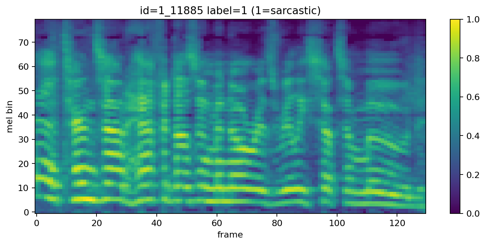

## Data (MUStARD audio)

This file documents the **ready-to-use preprocessed MUStARD audio dataset** in this repo, how it was produced, and how to use it. The raw data is from [this repo](https://github.com/soujanyaporia/MUStARD?tab=readme-ov-file).

For **model architecture, training, latent export, and generation** after these tensors exist, see [`MODEL.md`](MODEL.md).

### Contents

- [Preprocessed data summary (ready-to-use)](#preprocessed-data-summary-ready-to-use)
  - [What’s inside (`mustard_logmel.npz`)](#whats-inside-mustard_logmelnpz)
- [Using the preprocessed data](#using-the-preprocessed-data)
  - [Loading the data](#loading-the-data)
  - [What the tensors mean](#what-the-tensors-mean)
  - [Common gotchas](#common-gotchas)
- [MUStARD preprocessing](#mustard-preprocessing)
  - [Inputs (raw MUStARD artifacts)](#inputs-raw-mustard-artifacts)
  - [Run preprocessing (regenerate dataset)](#run-preprocessing-regenerate-dataset)
  - [Outputs](#outputs)
  - [Visualize a labeled mel-spectrogram](#visualize-a-labeled-mel-spectrogram)
  - [What actually happens in preprocessing?](#what-actually-happens-in-preprocessing)

---

## Preprocessed data summary (ready-to-use)

The repo includes a ready-to-use preprocessed dataset at:

- [`data/mustard_processed/mustard_logmel.npz`](../data/mustard_processed/mustard_logmel.npz)

### What’s inside (`mustard_logmel.npz`)

- **Splits / sample counts**:
  - train: **552** samples
  - val: **69** samples
  - test: **69** samples
- **Arrays / formats**:
  - `specs_{split}`: `(N, 1, 80, T)`, `float32` (normalized log-mel “images”; for default 5s config, `T` is typically `216`)
  - `labels_{split}`: `(N,)`, `int64` with `1 = sarcastic`, `0 = non-sarcastic`
  - `ids_{split}`: `(N,)`, `object` (string MUStARD IDs like `1_60`)
  - `tokens_{split}`: `(N, L)`, `int64` — BPE token IDs (fixed length `L`, padded; aligned row-for-row with `specs_*`)
  - `meta`: JSON string (stored as a 1-element object array) with preprocessing parameters + relative paths
- **Sidecar text artifacts** (same directory as the `.npz`):
  - `vocab.json`: token2id map + `meta` (`vocab_size`, `max_seq_len`, paths, etc.)
  - `tokenizer.json`: Hugging Face `tokenizers` model (used to re-encode or inspect merges)

## Using the preprocessed data

### Loading the data

```python
import numpy as np

d = np.load("data/mustard_processed/mustard_logmel.npz", allow_pickle=True)
X_train = d["specs_train"]     # (N, 1, 80, T), float32
y_train = d["labels_train"]    # (N,), int64
tok_train = d["tokens_train"]  # (N, L), int64
ids_train = d["ids_train"]     # (N,), object (strings)
```

### What the tensors mean

- `specs_*` are **normalized log-mel spectrograms** (default range `[0,1]`).
- Channel dimension is always `1`, so each item is an “image” of shape `(1, n_mels, n_frames)`.
- Labels are binary: `1 = sarcastic`, `0 = non-sarcastic`.
- `tokens_*` rows match `specs_*` by index (same split, same shuffle). Build the BPE vocabulary with [`export_text_tokens.py`](../export_text_tokens.py) if you regenerate splits.

### Vocoding (mel → waveform)

Stored mels are **[0, 1]** after train-fitted min–max on dB. Constants live in `mustard_logmel.norm_stats.json` (`lo`, `hi`, `sr`, `n_fft`, `hop_length`, …).

- **Griffin–Lim baseline** (no extra weights; good for sanity checks):

```bash
python vocode.py --split train --index 0 --out out.wav --backend griffin
```

- **HiFi-GAN (SpeechBrain, LJS checkpoint)** is optional (`--backend hifigan`). It expects a compatible mel distribution; upgrade `speechbrain` / `huggingface_hub` / `torchaudio` if Hugging Face download errors (see [`SETUP.md`](SETUP.md)).

### Common gotchas

- If you regenerate with different preprocessing flags (e.g. `--n-mels` or `--target-seconds`), the tensor shape will change; check `meta` inside the `.npz`.
- `spectrogram.py --index` refers to the index **within the stored split arrays**, which follow the shuffled split order (seeded).

### Why 5-second default windows?

- Raw MUStARD utterance durations are right-skewed with median around `4.76s` and mean around `5.22s`.
- Using `5.0s` as the default fixed window better matches that distribution than `3.0s`, which reduces aggressive truncation for many clips.
- We keep all examples (no outlier deletion) and still enforce fixed length for stable model input shapes.

## MUStARD preprocessing

### Inputs (raw MUStARD artifacts)

Expected layout under `cpsc440-project/data/`:

- **Labels**: `data/mustard_raw/sarcasm_data.json`
- **Utterance clips**: `data/mustard_raw/videos/utterances_final/{id}.mp4`
- **(Optional cache)** extracted wavs: `data/mustard_raw/audio/{id}.wav`
- **Outputs**: `data/mustard_processed/`

Notes:

- **Context clips** (`data/mustard_raw/videos/context_final/*_c.mp4`) are currently ignored.
- `preprocess.py` requires **`ffmpeg`** to be installed and available on your PATH.

### Run preprocessing (regenerate dataset)

```bash
python preprocess.py \
  --json-path data/mustard_raw/sarcasm_data.json \
  --mp4-dir data/mustard_raw/videos/utterances_final \
  --output-dir data/mustard_processed
```

Dry run (sanity check a small subset without writing outputs):

```bash
python preprocess.py --dry-run --limit 20
```

### Run transcript tokenization (required for training)

The CVAE training code conditions on **text tokens** (`tokens_*` in the merged `.npz`). After you
have `data/mustard_processed/mustard_logmel.npz`, run:

```bash
python export_text_tokens.py \
  --json-path data/mustard_raw/sarcasm_data.json \
  --npz-path data/mustard_processed/mustard_logmel.npz \
  --vocab-out data/mustard_processed/vocab.json \
  --tokenizer-out data/mustard_processed/tokenizer.json
```

This will:

- Train a small BPE tokenizer **on train utterances only** (same deterministic split as preprocessing).
- Write `vocab.json` (token ids + `meta`) and `tokenizer.json` (tokenizer model for inference).
- Merge `tokens_{train,val,test}` into `mustard_logmel.npz`, aligned row-for-row with `ids_*`.

### Outputs

Preprocessing writes:

- **`data/mustard_processed/mustard_logmel.npz`** containing:
  - `specs_train`, `labels_train`, `ids_train`
  - `specs_val`, `labels_val`, `ids_val`
  - `specs_test`, `labels_test`, `ids_test`
  - After running `export_text_tokens.py`: `tokens_train`, `tokens_val`, `tokens_test`
  - `meta` (JSON string with preprocessing parameters + relative paths)
- **`data/mustard_processed/mustard_logmel.manifest.jsonl`** (per-ID success/failure + paths)
- **`data/mustard_processed/mustard_logmel.norm_stats.json`** (train-only normalization constants)
- **After running** `export_text_tokens.py`:
  - **`data/mustard_processed/vocab.json`** (BPE vocabulary + `meta` like `vocab_size`, `max_seq_len`, `pad_id`)
  - **`data/mustard_processed/tokenizer.json`** (tokenizer model for encoding raw strings later)

### Visualize a labeled mel-spectrogram

```bash
python spectrogram.py --split train --index 0
# or save to file:
python spectrogram.py --split val --index 3 --save out/spec.png
```

Example output (`--split train --index 0`):



### What actually happens in preprocessing?

This section describes the exact processing path implemented in [`preprocess.py`](../preprocess.py).

#### 1) Load labels / IDs

- Load `data/mustard_raw/sarcasm_data.json`.
- Each key is a MUStARD example ID like `1_60`.
- The binary label is `label = int(bool(entry["sarcasm"]))` so:
  - `0` = non-sarcastic
  - `1` = sarcastic

#### 2) Deterministic random split (train/val/test)

- Collect all IDs and sort them.
- Shuffle them with Python’s `random.Random(seed).shuffle(ids)` using `--seed` (default `440`).
- Split by fractions:
  - train = `--train-frac` (default `0.8`)
  - val = `--val-frac` (default `0.1`)
  - test = remainder

This produces fixed, repeatable splits for the same seed + fractions.

#### 3) Resolve each ID to an MP4 clip

For each `clip_id` in a split:

- Construct `mp4_path = {mp4_dir}/{clip_id}.mp4`
  - by default `--mp4-dir data/mustard_raw/videos/utterances_final`
- If the MP4 is missing or decoding fails, that example is skipped (and the failure is recorded in the manifest for training IDs).

Context clips (`*_c.mp4`) are ignored in this pipeline.

#### 4) Decode MP4 → mono WAV (cached)

- WAV cache path: `{wav_cache_dir}/{clip_id}.wav` (default `data/mustard_raw/audio/`)
- If the wav doesn’t exist yet, run `ffmpeg` to extract **mono**, fixed-sample-rate PCM wav:
  - `-ac 1` (mono)
  - `-ar {sr}` (default `22050`)

This makes later runs faster because wavs are reused.

#### 5) Trim silence + enforce fixed duration

Given the wav waveform `y`:

- Trim leading/trailing silence via `librosa.effects.trim(y, top_db=trim_top_db)` (default `30 dB`).
- Enforce one fixed-duration example per utterance:
  - target length in samples = `target_seconds * sr` (default `5.0 * 22050`)
  - if longer: **center crop**
  - if shorter: **zero pad** equally left/right (center pad)

This yields a fixed-size waveform for every example.

#### 6) Log-mel spectrogram (dB)

Compute mel power then convert to dB:

- STFT params: `n_fft` (default `2048`), `hop_length` (default `512`)
- mel bins: `n_mels` (default `80`)
- Convert to dB with `librosa.power_to_db(..., ref=np.max)`

Result: `spec_db` shaped `(n_mels, n_frames)` (for defaults, `n_frames` is typically `216`).

#### 7) Train-only normalization stats

Normalization constants are fit using **training split only**:

- Gather `spec_db` across training examples that processed successfully.
- Compute either:
  - `minmax` (default): `lo = global_min`, `hi = global_max`, or
  - `percentile`: `lo = p(norm_low)`, `hi = p(norm_high)`

These are saved to `data/mustard_processed/mustard_logmel.norm_stats.json`.

#### 8) Scale each example to a stable numeric range

For every split (train/val/test):

- Scale: `x = clip((spec_db - lo)/(hi-lo), 0, 1)`
- Optionally remap to `[-1, 1]` if `--scale-range neg1_1` (default is `[0,1]`)
- Add a channel dimension so each example becomes `(1, n_mels, n_frames)`.

#### 9) Serialize outputs

Write `data/mustard_processed/mustard_logmel.npz` with:

- `specs_train`, `labels_train`, `ids_train` (and val/test)
- After running token export: `tokens_train`, `tokens_val`, `tokens_test` (same row order as the corresponding `specs_*` / `labels_*` / `ids_*`)
- `meta`: JSON string including preprocessing params and **relative paths**

Also write:

- `mustard_logmel.manifest.jsonl`: per-ID status for *training IDs* (ok/missing/exception) with relative paths

---
