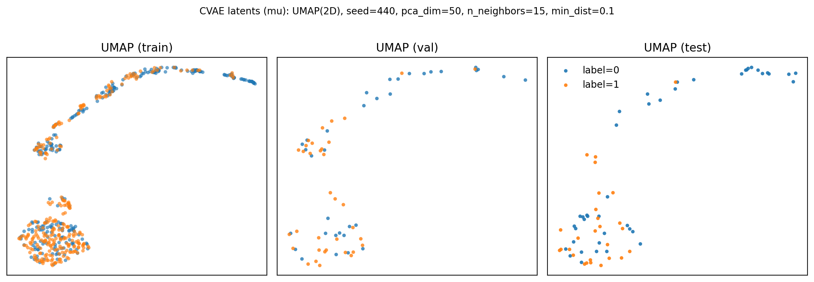
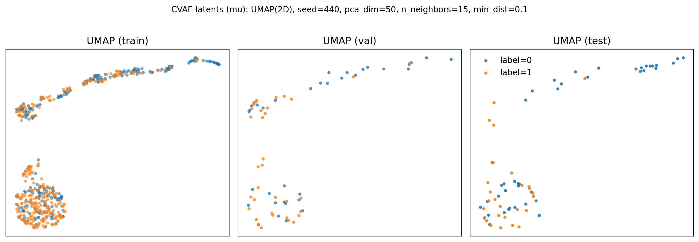

# Latent space analysis (`checkpoints/cvae_latents.npz`)

This doc explains how we explore the CVAE latent space exported by `python main.py vae-export-latents`, and how we answer (concisely) the question:

> Are sarcastic vs non-sarcastic utterances separable in the learned latent space?

### Contents

- [What data we use](#what-data-we-use)
- [Methods (one plot + one number)](#methods-one-plot--one-number)
- [How to generate latents](#how-to-generate-latents)
- [How to run the analysis script](#how-to-run-the-analysis-script)
- [Results](#results)
- [Interpretation (what we conclude)](#interpretation-what-we-conclude)
- [What might the “blob” vs “manifold” represent?](#what-might-the-blob-vs-manifold-represent)
- [Caveats](#caveats)
- [Possible improvements](#possible-improvements)

---

## What data we use

We analyze the exported arrays in `checkpoints/cvae_latents.npz`.

- The encoder in this project is **label-conditional** (it takes `y` as input), so the raw `mu_*` keys are computed as `mu = encode(x, text, y_true)` and can trivially carry label information.
- For *meaningful* analysis of sarcasm separability from `(x, text)` without feeding the true label into the encoder, we use the exported **label-fixed** embeddings:
  - `mu_y0_*`: encode every sample with `y=0`
  - `mu_y1_*`: encode every sample with `y=1`

In the plots/metrics below we show results for **both** `mu_y0_*` and `mu_y1_*` (they should be similar if the embedding is not overly sensitive to the fixed label used).

Dataset sizes / label balance (from `data/latent/probe_metrics_mu_y0.json` / `probe_metrics_mu_y1.json`):

- train: 552 samples (label 0: 269, label 1: 283)
- val: 69 samples (label 0: 34, label 1: 35)
- test: 69 samples (label 0: 42, label 1: 27)

## Methods (one plot + one number)

We keep this section short and reproducible:

- **UMAP (2D) plot** on standardized `mu_y0_*` / `mu_y1_*`, with points colored by sarcasm label.
  - Treat as a visual diagnostic only (UMAP can be sensitive to hyperparameters).
- **Linear probe (logistic regression) ROC-AUC** on held-out test split.
  - Train on `{mu_y0,mu_y1}_train` → evaluate on `{mu_y0,mu_y1}_test`.
  - This single metric answers: *is the label linearly recoverable from the latent representation?*
  - Include a quick label-shuffle sanity check: shuffling labels should yield AUC ≈ 0.5.

## How to generate latents

If you don’t already have `checkpoints/cvae_latents.npz`:

```bash
python main.py vae-export-latents
```

This loads `checkpoints/cvae_last.pt` and writes `checkpoints/cvae_latents.npz`.

## How to run the analysis script

Run the single exploration script:

```bash
python explore_latents.py \
  --latents checkpoints/cvae_latents.npz \
  --embedding mu_y0

python explore_latents.py \
  --latents checkpoints/cvae_latents.npz \
  --embedding mu_y1
```

This is what we ran (default settings), which correspond to:

- standardize the chosen embedding using `StandardScaler` fit on train
- PCA to 50 dims before UMAP
- UMAP settings: `n_neighbors=15`, `min_dist=0.1`, `seed=440`
- linear probe: logistic regression (balanced class weights), train on train split, evaluate on test split

Outputs:

- `img/umap_mu_y0.png`, `img/umap_mu_y1.png`
- `data/latent/probe_metrics_mu_y0.json`, `data/latent/probe_metrics_mu_y1.json`

## Results

### UMAP visualization

We embed the label-fixed embeddings into 2D with UMAP and plot each split separately (train/val/test), colored by sarcasm label.

#### `mu_y0_*` (encode all samples with fixed label 0)



#### `mu_y1_*` (encode all samples with fixed label 1)



### Quantitative: linear probe ROC-AUC

We train a logistic regression probe on the train split (standardized) and evaluate on the test split.

- **`mu_y0`**: test ROC-AUC **0.715**, shuffle AUC **0.502**
- **`mu_y1`**: test ROC-AUC **0.714**, shuffle AUC **0.502**

## Interpretation (what we conclude)

Both UMAPs show a consistent qualitative structure: the label-fixed latent means organize into two prominent regions across splits: (1) a dense “blob” in the lower-left and (2) a thinner, curved manifold across the top. Labels are **not perfectly clustered**, but there are **noticeable differences** in where label-1 points tend to occur:

- In **val/test**, the **top manifold is dominated by label 0** points, while **label 1** points appear more often in (and around) the **lower-left blob**.
- There is still **visible overlap** (especially within the lower-left region), so the embedding does not suggest a clean, separable “two-cluster” story in 2D.

Quantitatively, the linear probe achieves **test ROC-AUC ≈ 0.714–0.715** for both `mu_y0` and `mu_y1` (with shuffle AUC ≈ 0.502). The fact that results are nearly identical suggests the analysis is **not overly sensitive** to the choice of fixed label used at encode time, and that there is **some** sarcasm-related signal in the label-fixed embeddings that is linearly recoverable without feeding the true label into the encoder.

**Conclusion**: yes—based on both the UMAP visualization and the linear-probe AUC, there is **some separability** between sarcastic and non-sarcastic utterances in this model’s latent space (though not as perfectly separated clusters in 2D).

## What might the “blob” vs “manifold” represent?

UMAP is not directly interpretable, but a common pattern in speech/audio embeddings is that the largest axes of variation correspond to **non-label factors** that strongly affect acoustics. Two plausible, data-driven explanations for the dense blob vs the top curved manifold are:

- **Utterance-level acoustics (prosody/energy/tempo)**: differences in loudness/energy, speaking rate, pauses, or pitch dynamics can create large separations in mel-spectrogram space, which the encoder may preserve in `mu_*`.
- **Recording/speaker/domain effects**: consistent background noise, channel characteristics, or speaker identity can induce clusters/manifolds even when labels are mixed.

It’s reasonable to *hypothesize* that sarcasm correlates with some paralinguistic cues (intonation, timing, emphasis), but with this analysis alone we cannot attribute either region to “sarcasm” vs “non-sarcasm” in a causal sense.

If we wanted a lightweight explanation using observable audio features, we could test whether the blob/manifold correlates with simple statistics computed from each utterance’s mel (or waveform), e.g.:

- mean / variance of log-mel energy
- voiced/unvoiced ratio (or crude F0 presence)
- duration / number of frames (if variable-length exists upstream)
- spectral centroid / rolloff proxies

## Caveats

- UMAP/t-SNE-like embeddings can look separated due to parameter choices; treat the plot as a qualitative diagnostic.
- Our quantitative check uses a **single** train→test split and a **single** label shuffle; with only 69 test samples, both the probe AUC and shuffle AUC can have noticeable variance.
- Even with label-fixed embeddings, the probe may pick up on confounds (e.g., speaker/channel artifacts correlated with labels).

## Possible improvements

- **Repeat shuffles**: compute the shuffle AUC over many random shuffles (e.g., 50–200) and report mean ± std (single shuffle can be noisy on small test sets).
- **Train/val/test separation stress test**: compute probe AUC on val as well, and/or run k-fold CV on train for a more stable estimate.
- **Ablations**: compare `mu_*` vs `z_*`, and compare with/without PCA before UMAP.
- **Sensitivity sweep**: vary UMAP `n_neighbors`/`min_dist` and show the plot is qualitatively stable.
- **Confound checks**: test whether the probe is picking up on dataset artifacts (e.g., speaker/recording) rather than sarcasm, if those metadata are available.