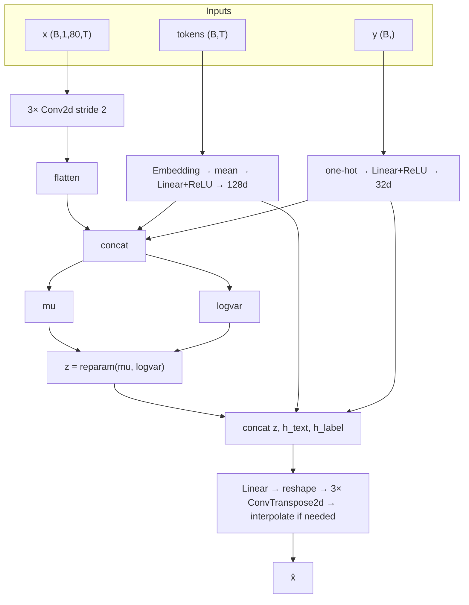

# Model (CVAE architecture)

This document follows [`DATA.md`](DATA.md) and describes **only the model** implemented in [`vae.py`](../vae.py): what goes in, what comes out, and how the encoder/decoder/latent are structured.

For anything operational:

- **Training + tuning**: see [`TUNING.md`](TUNING.md)
- **Post-training usage** (generation, reconstruction checks, latent exploration): see [`USAGE.md`](USAGE.md)

### Contents

- [Inputs (from the merged dataset)](#inputs-from-the-merged-dataset)
- [Model: conditional VAE (`VAE` in `vae.py`)](#model-conditional-vae-vae-in-vaepy)
  - [Encoder](#encoder)
  - [Latent and decoder](#latent-and-decoder)
  - [Loss (`cvae_loss` in `main.py`)](#loss-cvae_loss-in-mainpy)

---

## Inputs (from the merged dataset)

| Artifact | Role |
|----------|------|
| [`data/mustard_processed/mustard_logmel.npz`](../data/mustard_processed/mustard_logmel.npz) | `specs_*` `(N,1,80,T)` float mel in `[0,1]`, `labels_*`, `ids_*`, `tokens_*` |
| [`data/mustard_processed/vocab.json`](../data/mustard_processed/vocab.json) | BPE `meta`: `vocab_size`, `max_seq_len`, pad/unk ids |
| [`data/mustard_processed/tokenizer.json`](../data/mustard_processed/tokenizer.json) | Same BPE as training (used by usage scripts for encoding raw strings) |
| [`data/mustard_processed/mustard_logmel.norm_stats.json`](../data/mustard_processed/mustard_logmel.norm_stats.json) | Denorm / vocoding constants (used by usage scripts) |

**Code map:** [`vae.py`](../vae.py) defines `VAE`. The model consumes `(x, tokens, label)` and produces `(x̂, μ, logvar)`.

---

## Model: conditional VAE (`VAE` in `vae.py`)

The network maps:

- **Mel** `x`: `(batch, 1, 80, T)` — same layout as `specs_*` (`T` comes from preprocessing config).
- **Tokens** `(batch, T)` — BPE ids, padded length `T` = `max_seq_len` from `vocab.json` (typically 64).
- **Label** `y`: `(batch,)` int64, values `0` or `1` (same encoding as `labels_*`).

to a reconstruction `x̂` with the same shape as `x`, and (during training) a KL term on a Gaussian latent.

### Encoder

1. **Mel branch:** `Conv2d` stack: `1→32→64→128` channels, kernel 4, stride 2, padding 1 (three blocks). Output is flattened; size of that vector is computed at init from `spec_shape` (see `enc_shape` in code).
2. **Text branch:** `nn.Embedding(text_vocab_size, text_embed_dim)` → mean over sequence → `Linear` + ReLU → **128-d** `h_text`.
3. **Label branch:** `F.one_hot(y, 2)` → `Linear` + ReLU → **32-d** `h_label`.
4. Concatenate `[flat_mel, h_text, h_label]` → two linear heads → **`mu`** and **`logvar`**, each `(batch, latent_dim)` (default `latent_dim=64`).

### Latent and decoder

- **Reparameterization:** `z = mu + exp(0.5 * logvar) * epsilon`, `epsilon ~ Normal(0, I)` (see `reparameterize` in [`vae.py`](../vae.py)).
- **Decoder:** concat `[z, h_text, h_label]` → linear to vector of length `flattened CNN dim` → reshape to `enc_shape` → three `ConvTranspose2d` blocks mirroring the encoder. If output spatial size differs, **`F.interpolate`** bilinearly to `spec_shape[1:]`.

### Loss (`cvae_loss` in `main.py`)

- Reconstruction: `L1(x̂, x) + MSE(x̂, x)` (equal weights).
- KL: batch mean of `-0.5 * mean(1 + logvar - mu² - exp(logvar))` over latent dims.
- Total: `recon + beta * kl`, with `beta` ramped from `0` to `VAE_TARGET_BETA` over `VAE_KL_WARMUP_STEPS` steps (default `None` → `2 * len(train_loader)`).

See [`TUNING.md`](TUNING.md) for training/tuning commands, and [`USAGE.md`](USAGE.md) for generation, reconstruction checks, and latent-space exploration.
