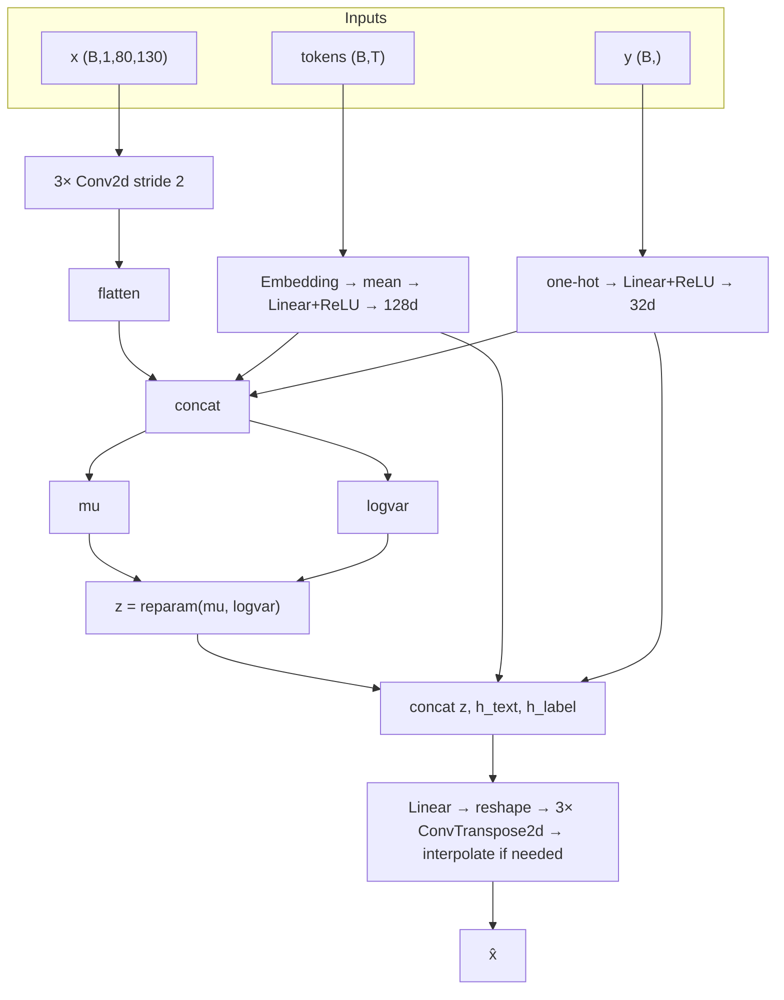

# Model, training, and inference

This document follows [`DATA.md`](DATA.md): it describes **what the codebase implements**—inputs, [`vae.py`](../vae.py) architecture, [`main.py`](../main.py) training and exports, and how to run [`vocode.py`](../vocode.py) / [`cvae_generate.py`](../cvae_generate.py).

### Contents

- [Inputs (from the merged dataset)](#inputs-from-the-merged-dataset)
- [Model: conditional VAE (`VAE` in `vae.py`)](#model-conditional-vae-vae-in-vaepy)
  - [Encoder](#encoder)
  - [Latent and decoder](#latent-and-decoder)
  - [Loss (`cvae_loss` in `main.py`)](#loss-cvae_loss-in-mainpy)
- [Training](#training)
  - [Constants (`main.py`)](#constants-mainpy)
  - [Outputs](#outputs)
  - [Other `main.py` commands](#other-mainpy-commands)
- [Latent export (`cvae_latents.npz`)](#latent-export-cvae_latentsnpz)
- [Evaluation and splits](#evaluation-and-splits)
- [Generation: text + label to mel / wav (`cvae_generate.py`)](#generation-text--label-to-mel--wav-cvae_generatepy)

---

## Inputs (from the merged dataset)

| Artifact | Role |
|----------|------|
| [`data/mustard_processed/mustard_logmel.npz`](../data/mustard_processed/mustard_logmel.npz) | `specs_*` `(N,1,80,130)` float mel in `[0,1]`, `labels_*`, `ids_*`, `tokens_*` |
| [`data/mustard_processed/vocab.json`](../data/mustard_processed/vocab.json) | BPE `meta`: `vocab_size`, `max_seq_len`, pad/unk ids |
| [`data/mustard_processed/tokenizer.json`](../data/mustard_processed/tokenizer.json) | Same BPE as training; used to encode raw text in [`cvae_generate.py`](../cvae_generate.py) |
| [`data/mustard_processed/mustard_logmel.norm_stats.json`](../data/mustard_processed/mustard_logmel.norm_stats.json) | `lo`/`hi` dB range, `sr`, `n_fft`, `hop_length` for vocoding |

**Code map:** [`vae.py`](../vae.py) defines `VAE`. [`main.py`](../main.py) runs `vae-train`, `vae-export-latents`, `vae-test`, and `cvae_loss` / `export_cvae_latents`. [`dataset.py`](../dataset.py) loads batches from the `.npz`. [`vocode.py`](../vocode.py) turns a mel tensor into audio; [`cvae_generate.py`](../cvae_generate.py) runs the decoder from text + label + sampled `z`.

---

## Model: conditional VAE (`VAE` in `vae.py`)

The network maps:

- **Mel** `x`: `(batch, 1, 80, 130)` — same layout as `specs_*`.
- **Tokens** `(batch, T)` — BPE ids, padded length `T` = `max_seq_len` from `vocab.json` (typically 64).
- **Label** `y`: `(batch,)` int64, values `0` or `1` (same encoding as `labels_*`).

to a reconstruction `x̂` with the same shape as `x`, and (during training) a KL term on a Gaussian latent.

### Encoder

1. **Mel branch:** `Conv2d` stack: `1→32→64→128` channels, kernel 4, stride 2, padding 1 (three blocks). Output is flattened; size of that vector is computed at init from `spec_shape` (see `enc_shape` in code).
2. **Text branch:** `nn.Embedding(text_vocab_size, text_embed_dim)` → mean over sequence → `Linear` + ReLU → **128-d** `h_text`.
3. **Label branch:** `F.one_hot(y, 2)` → `Linear` + ReLU → **32-d** `h_label`.
4. Concatenate `[flat_mel, h_text, h_label]` → two linear heads → **`mu`** and **`logvar`**, each `(batch, latent_dim)` (default `latent_dim=64`).

### Latent and decoder

- **Reparameterization:** `z = mu + exp(0.5 * logvar) * epsilon`, `epsilon ~ Normal(0, I)` (see `reparameterize` in [`vae.py`](../vae.py)).
- **Decoder:** concat `[z, h_text, h_label]` → linear to vector of length `flattened CNN dim` → reshape to `enc_shape` → three `ConvTranspose2d` blocks mirroring the encoder. If output spatial size ≠ `(80, 130)`, **`F.interpolate`** bilinearly to `spec_shape[1:]`.

### Loss (`cvae_loss` in `main.py`)

- Reconstruction: `L1(x̂, x) + MSE(x̂, x)` (equal weights).
- KL: batch mean of `-0.5 * mean(1 + logvar - mu² - exp(logvar))` over latent dims.
- Total: `recon + beta * kl`, with `beta` ramped from `0` to `VAE_TARGET_BETA` over `VAE_KL_WARMUP_STEPS` steps (default `None` → `2 * len(train_loader)`).



---

## Training

```bash
cd cpsc440-project
python main.py vae-train
```

Requires `tokens_*` in the `.npz` and [`vocab.json`](../data/mustard_processed/vocab.json) (from [`export_text_tokens.py`](../export_text_tokens.py)).

### Constants (`main.py`)

| Name | Default | Effect |
|------|---------|--------|
| `VAE_BATCH_SIZE` | 16 | DataLoader batch size |
| `VAE_EPOCHS` | 5 | Training epochs |
| `VAE_LR` | 1e-3 | Adam learning rate |
| `VAE_TARGET_BETA` | 0.1 | Target weight on KL after warmup |
| `VAE_LATENT_DIM` | 64 | Passed to `VAE(...)`; stored in checkpoint |
| `VAE_KL_WARMUP_STEPS` | `None` | If `None`, uses `max(1, 2 * len(train_loader))` |
| `EXPORT_LATENTS_AFTER_TRAIN` | `True` | Calls `export_cvae_latents` after the last epoch |
| `LATENT_EXPORT_SEED` | 440 | Torch generator seed for `z_*` in the export |

Each epoch prints train/val reconstruction and KL means. Checkpoints include `train_hparams` with the same values used for that run.

### Example training output (how to read it)

When you run `python main.py vae-train`, you’ll see one progress line per epoch (from `tqdm`) plus a short summary line with epoch averages:

```text
epoch 1/5 train: 100%|██████████████| 34/34 [00:03<00:00, 10.14it/s, beta=0.049, kl=0.1782, recon=0.1648]
epoch 1: train recon 0.2336 kl 0.2843 | val recon 0.1548 kl 0.1509
epoch 2/5 train: 100%|██████████████| 34/34 [00:03<00:00,  9.10it/s, beta=0.099, kl=0.1216, recon=0.1687]
epoch 2: train recon 0.1563 kl 0.1123 | val recon 0.1567 kl 0.0924
epoch 3/5 train: 100%|██████████████| 34/34 [00:03<00:00,  8.96it/s, beta=0.100, kl=0.0623, recon=0.1304]
epoch 3: train recon 0.1495 kl 0.0952 | val recon 0.1427 kl 0.0930
epoch 4/5 train: 100%|██████████████| 34/34 [00:03<00:00,  9.89it/s, beta=0.100, kl=0.1107, recon=0.1387]
epoch 4: train recon 0.1460 kl 0.1080 | val recon 0.1472 kl 0.1224
epoch 5/5 train: 100%|██████████████| 34/34 [00:03<00:00, 10.46it/s, beta=0.100, kl=0.0973, recon=0.1406]
epoch 5: train recon 0.1437 kl 0.1106 | val recon 0.1326 kl 0.1316
```

- **`epoch k/K train: ... 34/34 ... it/s`**: training progress for that epoch (34 mini-batches here). The `beta`, `kl`, and `recon` shown on this line are the **most recent batch’s** values.
- **`beta=...`**: the current KL weight used in `loss = recon + beta * kl`. It ramps up during warmup and then stays at `VAE_TARGET_BETA`.
- **`recon=...`**: the current batch’s reconstruction loss (`L1 + MSE`) on normalized mels.
- **`kl=...`**: the current batch’s KL term (how close the encoder posterior is to `Normal(0, I)`).
- **`epoch k: train recon ... kl ... | val recon ... kl ...`**: **epoch averages** over the train and val splits. These are the numbers to track for learning progress (as opposed to the last-batch values in the progress bar).

### Outputs

| Path | Contents |
|------|----------|
| `checkpoints/cvae_last.pt` | **Trained model checkpoint**: `model` (state_dict) + `spec_shape`, `text_vocab_size`, `latent_dim`, `train_hparams` |
| `checkpoints/cvae_latents.npz` | **Latent export** (for t-SNE/UMAP): arrays `mu_*`, `z_*`, `ids_*`, `labels_*`, `meta_json` |

By default, [`.gitignore`](../.gitignore) ignores most training artifacts but allows committing these two files so others can reuse the trained model and latents.

### Other `main.py` commands

| Command | Behavior |
|---------|----------|
| `python main.py vae-test` | Synthetic mel + random tokens; short Adam loop; matplotlib recon plot |
| `python main.py vae-export-latents` | Loads `cvae_last.pt`, runs encoder on train/val/test in order, writes/overwrites `cvae_latents.npz` |

---

## Latent export (`cvae_latents.npz`)

Load with `numpy.load(..., allow_pickle=True)` (string `ids_*`).

| Key | Description |
|-----|-------------|
| `mu_train`, `mu_val`, `mu_test` | Encoder output `mu`, shape `(N, latent_dim)` |
| `z_train`, `z_val`, `z_test` | One reparameterized sample per row (RNG seeded by `LATENT_EXPORT_SEED`, batch order as in `MustardMelDataset`) |
| `labels_*` | Same as `labels_*` in the `.npz` |
| `ids_*` | Same MUStARD ids as in the `.npz`, row-aligned |
| `meta_json` | JSON string: `latent_dim`, `seed`, `npz_path`, short note |

Row order matches sequential indexing of [`MustardMelDataset`](../dataset.py) for each split (same as `.npz` row order).

---

## Evaluation and splits

- Train/val/test partitions follow the same deterministic split as preprocessing ([`DATA.md`](DATA.md), [`mustard_split.py`](../mustard_split.py)).
- For reconstruction on **real** clips: load `specs_test` / `tokens_test` / `labels_test`, run `model(x, tokens, labels)`, compare `x` and `x̂` (e.g. MSE or plots). `vae-test` only exercises **synthetic** data.
- Training objective is **reconstruction + KL**, not classification accuracy on sarcasm.

---

## Generation: text + label to mel / wav (`cvae_generate.py`)

This path **does not** use a reference mel. It:

1. Encodes `--text` with `tokenizer.json`, pads/truncates to `max_seq_len` from `vocab.json` `meta`.
2. Samples `z ~ Normal(0, z_scale² I)` (default `z_scale=1`, `--seed` for reproducibility).
3. Runs `model.decode(z, tokens, label)`.
4. Clamps mel to `[0, 1]`.
5. If `--out-mel`: saves `.npy` `(1, 80, 130)`. If `--out-wav`: denormalizes with `mustard_logmel.norm_stats.json` and Griffin–Lim via [`vocode.py`](../vocode.py) helpers.

```bash
python cvae_generate.py --text "..." --label 0 --out-mel gen.npy
python cvae_generate.py --text "..." --label 1 --out-wav gen.wav --seed 123
```

Optional: `--checkpoint`, `--tokenizer`, `--vocab`, `--npz`, `--z-scale`. The decoder was trained with `z` from the **encoder**; sampling `z` from a spherical Gaussian is an approximate inference-time use of the same `decode` (as in standard VAE sampling).

A **repository-wide file map** (including preprocessing and docs) is in the [`README`](../README.md). Tensor shapes and layer definitions are authoritative in [`vae.py`](../vae.py); step counts and checkpoints are authoritative in [`main.py`](../main.py).
