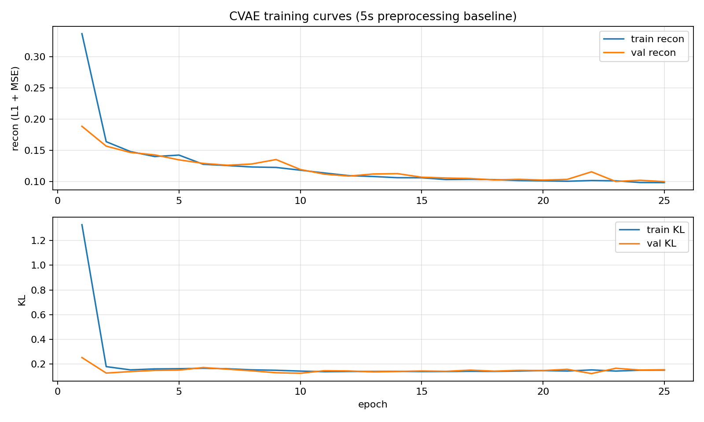

## Tuning guide (CVAE training + generation)

This guide is intentionally **instructional**: it summarizes the current baseline training behavior and gives concrete, reversible tuning steps to improve the model—especially **generation quality for data augmentation**.

Prereqs:

- Read [`DATA.md`](DATA.md) for how `mustard_logmel.npz` + `tokens_*` are produced.
- Read [`MODEL.md`](MODEL.md) for what the model/loss are and what artifacts are saved.

### Contents

- [Current baseline (what we have now)](#current-baseline-what-we-have-now)
  - [How to reproduce the baseline](#how-to-reproduce-the-baseline)
  - [What “good” looks like in logs](#what-good-looks-like-in-logs)
- [What we’re optimizing](#what-were-optimizing)
- [Quick checklist before tuning](#quick-checklist-before-tuning)
- [Tuning for better generation (priority)](#tuning-for-better-generation-priority)
  - [1) Train longer (most reliable)](#1-train-longer-most-reliable)
  - [2) Beta and KL warmup (controls “sampleability”)](#2-beta-and-kl-warmup-controls-sampleability)
  - [3) Latent dimensionality](#3-latent-dimensionality)
  - [4) Learning rate and batch size](#4-learning-rate-and-batch-size)
  - [5) Sampling controls for augmentation](#5-sampling-controls-for-augmentation)
- [Tuning for better reconstruction (secondary)](#tuning-for-better-reconstruction-secondary)
- [How to evaluate changes (minimal + practical)](#how-to-evaluate-changes-minimal--practical)
  - [A) Reconstruction sanity checks](#a-reconstruction-sanity-checks)
  - [B) Generation sanity checks](#b-generation-sanity-checks)
  - [C) Latent-space sanity checks](#c-latent-space-sanity-checks)
- [Rollback / revert strategy](#rollback--revert-strategy)

---

## Current baseline (what we have now)

The current training loop is `python main.py vae-train` (see [`main.py`](../main.py)). The **baseline** is:

- **`VAE_EPOCHS = 25`** (trained for 25 epochs)
- **`VAE_TARGET_BETA = 0.1`**
- **`VAE_LATENT_DIM = 64`**
- **`VAE_LR = 1e-3`**
- **`VAE_BATCH_SIZE = 16`**
- **`VAE_SEED = 440`** (best-effort reproducibility)
- KL warmup: `VAE_KL_WARMUP_STEPS = None` → computed as `2 * len(train_loader)`

An example 25-epoch run summary looked like:

```text
epoch 1: train recon 0.2336 kl 0.2843 | val recon 0.1548 kl 0.1509
epoch 2: train recon 0.1563 kl 0.1123 | val recon 0.1567 kl 0.0924
epoch 3: train recon 0.1495 kl 0.0952 | val recon 0.1427 kl 0.0930
epoch 4: train recon 0.1460 kl 0.1080 | val recon 0.1472 kl 0.1224
epoch 5: train recon 0.1437 kl 0.1106 | val recon 0.1326 kl 0.1316
...
epoch 25: train recon 0.1047 kl 0.1143 | val recon 0.1041 kl 0.1270
```

Interpretation:

- **Recon decreases substantially** (e.g. `val recon` from ~0.15 → ~0.10 by epoch 25) → training is healthy.
- **KL stays nonzero** → the latent is being used (not obviously collapsed).
- **Val recon ~ train recon** throughout → no obvious overfitting in 25 epochs.

### Baseline training summary plot

The baseline run can optionally write a 1-page summary plot (recon + KL curves):

- `img/train_summary_epoch25.png`



How to read it:

- **Top panel (recon)**: `train recon` and `val recon` should generally go down and remain close.
  - If train decreases but val increases → likely overfitting / need regularization or fewer epochs.
- **Bottom panel (KL)**: `train KL` and `val KL` should stay **nonzero**.
  - If KL collapses to ~0 and stays there, the model may ignore the latent (bad for generation from sampled `z`).
  - If KL spikes while recon gets much worse, beta/warmup may be too aggressive.

### How to reproduce the baseline

From `cpsc440-project/`:

```bash
# Ensure tokens exist (required for training)
python export_text_tokens.py

# Train (overwrites checkpoints/cvae_last.pt and usually checkpoints/cvae_latents.npz)
python main.py vae-train --plot img/train_summary_epoch25.png
```

### What “good” looks like in logs

During tuning, it’s normal for recon/KL to trade off. For generation, you typically want:

- KL **not** ≈ 0 for all epochs (collapse risk).
- Recon decreasing, even if it’s slightly worse than a pure autoencoder.
- Stable val curves (no explosion).

---

## What we’re optimizing

We care about both:

- **A) Reconstruction quality**: given `(x, tokens, label)`, the model reconstructs `x̂` close to `x`.
- **B) Generation quality for augmentation (priority)**: given **only** `(raw text, desired label)`, we sample `z ~ Normal(0, I)` (or scaled) and decode a **plausible** mel, then optionally vocode to `.wav`.

For B, the key is: **training must produce latents that are “sampleable.”** That is exactly what the KL term and warmup influence.

---

## Quick checklist before tuning

1. **Confirm your data is tokenized**: `mustard_logmel.npz` should contain `tokens_train/val/test`. See [`DATA.md`](DATA.md).
2. **Don’t lose previous results**: before a new run, copy/rename your checkpoints:

```bash
mkdir -p checkpoints/runs
cp checkpoints/cvae_last.pt checkpoints/runs/cvae_last_baseline.pt
cp checkpoints/cvae_latents.npz checkpoints/runs/cvae_latents_baseline.npz
```

3. **Keep generation tests fixed**: pick 3–5 fixed prompts and a fixed `--seed` for `cvae_generate.py` so you can compare runs.

---

## Tuning for better generation (priority)

All knobs below are constants near the top of [`main.py`](../main.py). Make one change at a time, retrain, and compare against the baseline plot/logs.

### Knobs (quick table)

| Knob | Baseline | Try | Expected effect | Risk / rollback |
|------|----------|-----|-----------------|-----------------|
| `VAE_EPOCHS` | 25 | 40 → 60 | Often improves recon; may also stabilize decoder | Overfit later; revert epochs + restore prior checkpoint |
| `VAE_TARGET_BETA` | 0.1 | 0.2 (or 0.05) | Higher β can improve **prior sampling** (B); lower β improves recon (A) | Too high β harms recon; too low β hurts sampling |
| `VAE_KL_WARMUP_STEPS` | None | longer warmup (e.g. 170) | Smoother training; avoids early KL dominance | Too short warmup can destabilize; revert to None |
| `VAE_LATENT_DIM` | 64 | 32 or 128 | 32 can regularize/simplify sampling; 128 adds capacity | Must match at usage time; keep per-run checkpoints |
| `VAE_LR` | 1e-3 | 3e-4 (or 2e-3) | Lower LR can stabilize posterior; higher can speed up | Too high may diverge; revert LR |
| `VAE_BATCH_SIZE` | 16 | 32 (if GPU) | Smoother gradients | May require LR retune; revert batch |

### Post-training sampling knob (no retrain)

When judging generation quality, also try `cvae_generate.py --z-scale 0.5` (less noise) vs `--z-scale 1.2` (more diversity). This is a cheap knob to sweep when comparing tuned runs.

---

## Tuning for better reconstruction (secondary)

If recon is the focus, you generally do the opposite:

- Lower `VAE_TARGET_BETA` (e.g. `0.05`) to prioritize reconstruction.
- Increase `VAE_LATENT_DIM`.
- Train longer.

But note: these changes can make sampling from `z~Normal(0,I)` worse, which hurts augmentation.

---

## How to evaluate changes (minimal + practical)

### A) Reconstruction sanity checks

On a few fixed examples:

- compare mel plots (input vs recon)
- compare `recon` value trend across epochs

#### Compare input wav vs reconstructed wav (encoder → decoder → vocoder)

To check reconstruction quality end-to-end, use [`cvae_reconstruct.py`](../cvae_reconstruct.py):

```bash
python cvae_reconstruct.py \
  --split train --index 0 \
  --out-in-wav out/in.wav \
  --out-recon-wav out/recon.wav \
  --n-griffin 64
```

Interpretation:

- `out/in.wav` is the vocoder output from the stored dataset mel.
- `out/recon.wav` is vocoded from the model reconstruction `x̂`.
- If `out/recon.wav` is much worse than `out/in.wav`, that’s a reconstruction problem (not just vocoder limits).

What you should expect to hear:

- Both files will sound like **low-quality, muffled speech** (Griffin–Lim artifacts are normal).
- `out/in.wav` is the best-case reference under this vocoder (it comes from the dataset mel directly).
- `out/recon.wav` should have **similar rhythm/energy patterns** as `out/in.wav` if reconstruction is good, but it may be blurrier or noisier.
- If `out/recon.wav` turns into mostly noise or loses the speech-like cadence compared to `out/in.wav`, the model is not reconstructing well (often undertraining, overly strong KL pressure, or insufficient capacity).

### B) Generation sanity checks

Pick a fixed prompt list and evaluate per run:

```bash
python cvae_generate.py --text "Well that's just great." --label 1 --out-wav out/gen1.wav --seed 123 --z-scale 0.7
python cvae_generate.py --text "Thanks for your help." --label 0 --out-wav out/gen2.wav --seed 123 --z-scale 0.7
```

Listen for:

- gross artifacts / noise (reduce `--z-scale` or tune beta/warmup)
- mode collapse (same-sounding outputs for different prompts; try higher beta or longer warmup)

### C) Latent-space sanity checks

After training:

```bash
python main.py vae-export-latents
```

Use `mu_*` for stable t-SNE/UMAP (see [`MODEL.md`](MODEL.md#latent-export-cvae_latentsnpz)).

---

## Rollback / revert strategy

Because training overwrites `checkpoints/cvae_last.pt` and `checkpoints/cvae_latents.npz`, treat each run as a “versioned artifact”:

1. **Before** retraining, copy baseline to `checkpoints/runs/`.
2. Use descriptive names:
   - `cvae_last_beta0p2_warmup170_lat32.pt`
   - `cvae_latents_beta0p2_warmup170_lat32.npz`
3. If a tuning attempt is worse, restore by copying the previous “best” back to the default names:

```bash
cp checkpoints/runs/cvae_last_baseline.pt checkpoints/cvae_last.pt
cp checkpoints/runs/cvae_latents_baseline.npz checkpoints/cvae_latents.npz
```

If you are using git commits for code changes, the safest pattern is:

- commit hyperparameter changes separately
- keep artifacts (`cvae_last.pt`, `cvae_latents.npz`) in a commit only when you want teammates to use that exact model
